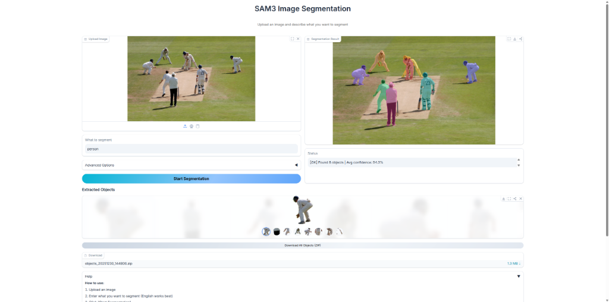

# SAM3 Image Segmentation Studio

<p align="center">
  
</p>

<p align="center">
  <a href="https://huggingface.co/spaces/viaho/sam3-gradio">
    
  </a>
  <a href="https://github.com/via007/sam3-gradio">
    
  </a>
</p>

A simple and elegant image segmentation tool powered by **SAM3 (Segment Anything Model 3)**. Just upload an image and describe what you want to segment!

## Try it Online

**[Click here to try the online demo on Hugging Face Spaces](https://huggingface.co/spaces/viaho/sam3-gradio)**

No installation required! Just upload an image and start segmenting.

## Features

- **Text-based Segmentation**: Describe objects in natural language (e.g., "cat", "person", "red car")
- **Transparent Background Export**: All extracted objects are saved as PNG with transparent background
- **Batch Download**: Download all segmented objects as a ZIP file
- **Modern UI**: Clean interface built with Gradio

## Quick Start

### 1. Clone the repository

```bash
git clone https://github.com/via007/sam3-gradio.git
cd sam3-gradio
```

### 2. Install SAM3

Please refer to the official SAM3 repository for installation:

- **GitHub**: <https://github.com/facebookresearch/sam3>
- **Hugging Face**: <https://huggingface.co/facebook/sam3>

```bash
# Install SAM3 from GitHub
pip install git+https://github.com/facebookresearch/sam3.git
```

### 3. Download the model

Download the SAM3 model checkpoint from [Hugging Face](https://huggingface.co/facebook/sam3) and place it in the `model/` directory:

```
model/
└── sam3.pt
```

> **Note**: You need to agree to share your contact information on Hugging Face to access the model.

### 4. Install other dependencies

```bash
pip install -r requirements.txt
```

### 5. Run the application

```bash
python gradio_app.py
```

The application will start at `http://localhost:10029`

## Usage

1. **Upload an image**
2. **Enter what you want to segment** (English works best, e.g., "cat", "person", "car")
3. **Click "Start Segmentation"**
4. **Download** the extracted objects (transparent PNG)

### Prompt Examples

| Type | Example |
|------|---------|
| Single object | `cat`, `dog`, `person`, `car` |
| Multiple objects | `cat and dog`, `all people` |
| With attributes | `red car`, `black cat`, `tall building` |

### Advanced Options

- **Confidence Threshold**: Higher = stricter detection (recommended: 0.3-0.7)
- **Max Objects**: Limit the number of results (0 = unlimited)
- **Min Area**: Filter out small fragments (0 = no filter)

## Requirements

- Python 3.8+
- PyTorch 2.0+
- CUDA (recommended for GPU acceleration)

## License

MIT License

## Acknowledgments

- [SAM3](https://github.com/facebookresearch/sam3) by Meta AI
- [Gradio](https://gradio.app/) for the web interface

---

[中文文档](#中文文档)

---

# 中文文档

# SAM3 图像分割工作室

<p align="center">
  
</p>

<p align="center">
  <a href="https://huggingface.co/spaces/viaho/sam3-gradio">
    
  </a>
</p>

基于 **SAM3 (Segment Anything Model 3)** 的简洁优雅的图像分割工具。只需上传图片并描述你想分割的内容！

## 在线体验

**[点击这里在 Hugging Face Spaces 上在线体验](https://huggingface.co/spaces/viaho/sam3-gradio)**

无需安装！上传图片即可开始分割。

## 功能特性

- **文本分割**：使用自然语言描述对象（如 "cat"、"person"、"red car"）
- **透明背景导出**：所有提取的对象保存为透明背景 PNG
- **批量下载**：一键打包下载所有分割对象（ZIP 格式）
- **现代界面**：基于 Gradio 构建的简洁界面

## 快速开始

### 1. 克隆仓库

```bash
git clone https://github.com/via007/sam3-gradio.git
cd sam3-gradio
```

### 2. 安装 SAM3

请参考官方 SAM3 仓库进行安装：

- **GitHub**: <https://github.com/facebookresearch/sam3>
- **Hugging Face**: <https://huggingface.co/facebook/sam3>

```bash
# 从 GitHub 安装 SAM3
pip install git+https://github.com/facebookresearch/sam3.git
```

### 3. 下载模型

从 [Hugging Face](https://huggingface.co/facebook/sam3) 下载 SAM3 模型文件并放置在 `model/` 目录下：

```
model/
└── sam3.pt
```

> **注意**：你需要在 Hugging Face 上同意分享联系信息才能下载模型。

### 4. 安装其他依赖

```bash
pip install -r requirements.txt
```

### 5. 运行应用

```bash
python gradio_app.py
```

应用将在 `http://localhost:10029` 启动

## 使用方法

1. **上传图片**
2. **输入分割目标**（使用英文效果更好，如 "cat"、"person"、"car"）
3. **点击 "Start Segmentation"**
4. **下载** 提取的对象（透明背景 PNG）

### 提示词示例

| 类型 | 示例 |
|------|------|
| 单个对象 | `cat`, `dog`, `person`, `car` |
| 多个对象 | `cat and dog`, `all people` |
| 带属性 | `red car`, `black cat`, `tall building` |

### 高级选项

- **置信度阈值**：越高越严格（建议：0.3-0.7）
- **最大对象数**：限制返回数量（0 = 不限制）
- **最小面积**：过滤小碎片（0 = 不过滤）

## 环境要求

- Python 3.8+
- PyTorch 2.0+
- CUDA（推荐使用 GPU 加速）

## 许可证

MIT License

## 致谢

- [SAM3](https://github.com/facebookresearch/sam3) by Meta AI
- [Gradio](https://gradio.app/) 用于 Web 界面
